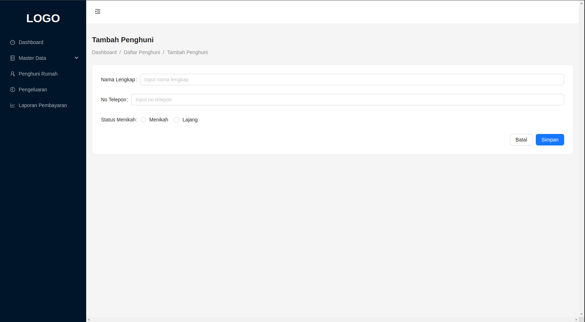
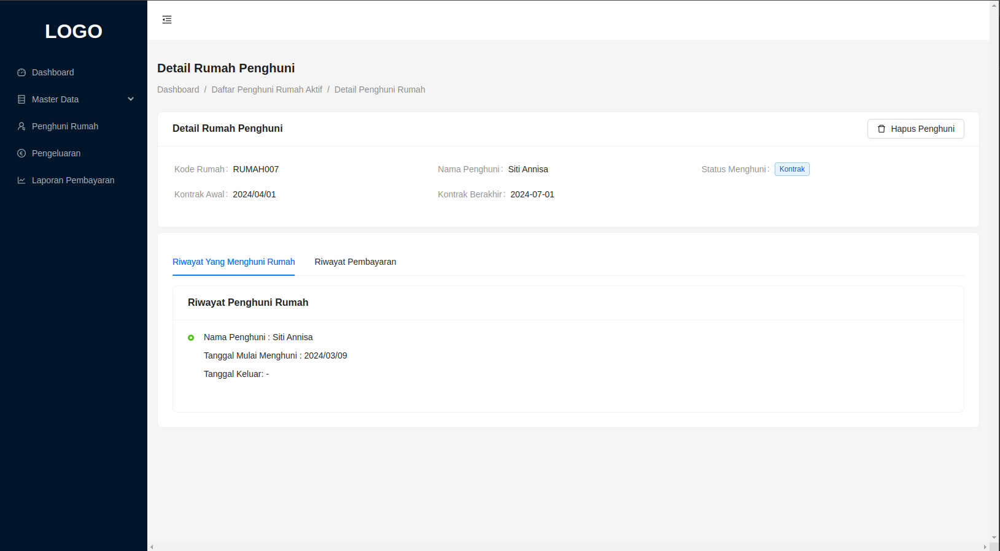

# Rangkuman
## ERD 
Berikut adalah ERD dari aplikasi ini.

## Daftar Fitur
Direktori ini adalah list fitur yang ada dalam aplikasi ini.

### Module Rumah
Module ini digunakan untuk menambah, mengubah, dan melihat daftar rumah yang tersedia beserta dengan status penghuninya.

#### Tambah Rumah
screenshot :

#### Edit Rumah
screenshot :

#### Daftar Rumah
screenshot :

### Module Penghuni
Module ini digunakan untuk menambah penghuni serta mengubah informasi dari penghuni

#### Tambah Penghuni
screenshot :

#### Edit Penghuni
screenshot :

#### Upload KTP
screenshot :

#### Daftar Penghuni
screenshot :

### Module Iuran Bulanan
Module ini digunakan untuk menambah dan juga mengedit iuran bulanan yang akan dibayarkan oleh penghuni rumah.

#### Tambah Iuran Bulanan
screenshot :

#### Edit Iuran Bulanan
screenshot :

#### Daftar Iuran Bulanan
screenshot :

### Module Penghuni Rumah
Module ini digunakan untuk menambahkan calon penghuni rumah, dengan rumah yang tersedia untuk dihuni.

#### Daftar Penghuni Rumah Akrif
screenshot : 

#### Tambah Penghuni Rumah
Pada screenshot di bawah ini, input dropdown `Penghuni`, ia hanya akan menampilkan list penghuni yang sedang tidak menghuni suatu rumah. Sedangkan untuk input dropdown `Rumah` , Ia hanya menampilakn list rumah yang kosong.

screenshot :

#### Detail Penghuni Rumah
##### Penghuni Rumah Tetap
screenshot :

##### Penghuni Rumah Kontrak
screenshot :

##### Pembayaran Belum Lunas
screenshot :

##### Pembayaran Lunas Bulan Ini
screenshot :

##### Riwayat Pembayaran yang Sudah Lunas
screenshot :

#### Tambah Pembayaran
screenshot :

### Module Pengeluaran
Module ini digunakan untuk menambah pengeluaran

#### Tambah Pengeluaran
screenshot :

#### Daftar Pengeluaran
screenshot :

### Module Laporan Pembayaran
Module ini digunakan untuk melihat laporan keuangan

#### Laporan Pemasukan
screenshot :

#### Laporan Pengeluaran
screenshot :

#### Grafik Pemasukan dan Pengeluaran
screenshot :

